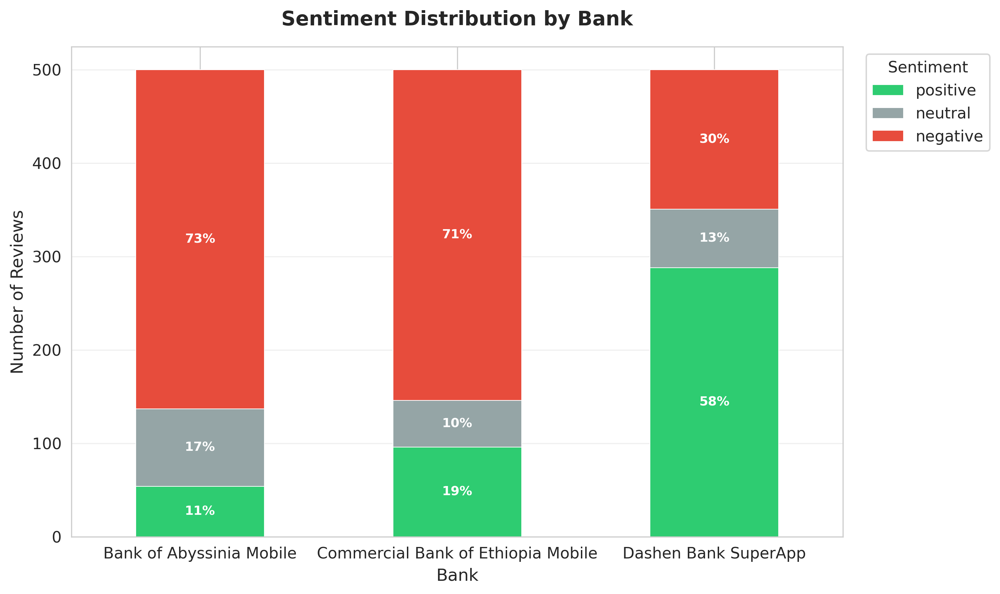
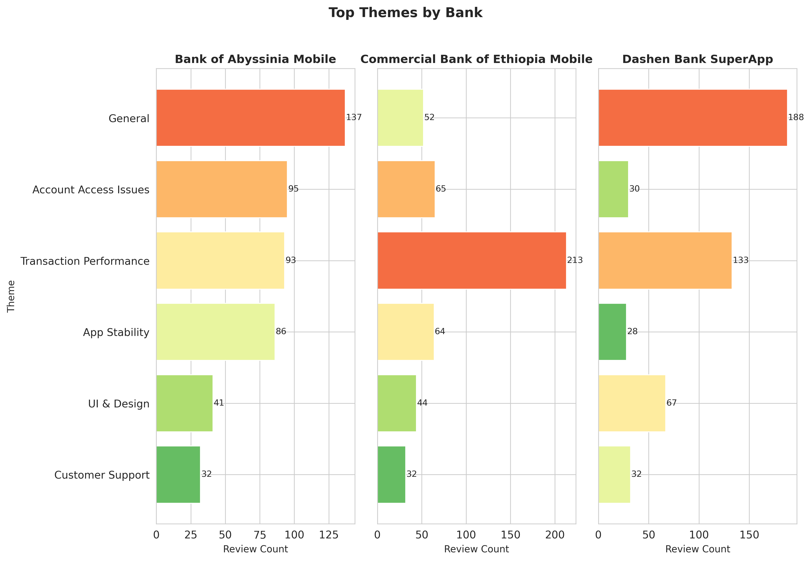

# Fintech Review Analytics

> **10 Academy Week 2 Challenge** — Customer Experience Analytics for Ethiopian Fintech Apps



## 📌 Overview

This project implements a complete end-to-end data analytics pipeline designed to extract, process, analyze, and visualize user feedback for major Ethiopian fintech applications. By leveraging Natural Language Processing (NLP) and relational database storage, we transform raw Google Play Store reviews into business-actionable insights.

### Targets
- **Commercial Bank of Ethiopia (CBE)**: Ethiopia's largest state-owned bank.
- **Bank of Abyssinia (BOA)**: A leading private banking institution.
- **Dashen Bank**: Known for its innovative "SuperApp" ecosystem.

---

## 🛠️ Technology Stack

- **Data Collection**: `google-play-scraper`
- **Data Processing**: `Pandas`, `NumPy`
- **NLP / Sentiment Analysis**: `DistilBERT` (Hugging Face Transformers), `VADER`
- **Database**: `PostgreSQL` (Relational storage with `psycopg2`)
- **Analysis**: Custom keyword-based thematic extraction
- **Visualization**: `Matplotlib`, `Seaborn`
- **Documentation**: Markdown, `tabulate`

---

## 📂 Project Structure

```text
├── data/               # Raw and processed CSV data
├── notebooks/          # Exploratory analysis (Jupyter)
├── reports/            # Generated insights and visualizations
│   ├── figures/        # PNG plots for reports
│   └── final_report.md # Comprehensive business analysis
├── scripts/            # Executable pipeline scripts
├── sql/                # Postgres schema definitions
├── src/                # Core logic (DB, Scraper, NLP, Viz)
├── tests/              # Unit tests
├── .env.example        # Environment variable template
├── requirements.txt    # Python dependencies
└── README.md           # This file
```

---

## 🚀 Pipeline Workflow

### 1. Data Collection (`scrape_reviews.py`)
Scrapes the most recent reviews for configured apps, handling rate limits and batching. Target: 1,200+ total reviews.

### 2. Preprocessing (`preprocess_reviews.py`)
Cleans text data, removes duplicates, handles missing values, and normalizes date formats.

### 3. Sentiment & Thematic Analysis (`sentiment_analysis.py`)
- classifies reviews into **Positive**, **Neutral**, and **Negative** using a pre-trained DistilBERT model.
- Maps reviews to 6 key business themes (e.g., *Account Access*, *Transaction Performance*, *App Stability*) using keyword-based analysis.

### 4. Database Loading (`load_to_postgres.py`)
Populates a PostgreSQL database with a normalized schema, enabling complex SQL queries for business intelligence.

### 5. Insights Generation (`generate_insights.py`)
Generates 5+ professional visualizations and a detailed Markdown report synthesizing findings and providing evidence-based recommendations.

---

## 📊 Insights Preview

| Bank | Avg Rating | Positive Sentiment % | Primary Pain Point |
| :--- | :--- | :--- | :--- |
| Bank of Abyssinia | 1.69 | 10.8% | Account Access Issues |
| CBE | 2.67 | 19.2% | Transaction Performance |
| Dashen Bank | 3.84 | 57.6% | Account Access Issues |

### Key Visualization


---

## ⚙️ Setup & Installation

1. **Clone the repository**:
   ```bash
   git clone https://github.com/nursu79/fintech-review-analytics.git
   cd fintech-review-analytics
   ```

2. **Install dependencies**:
   ```bash
   pip install -r requirements.txt
   ```

3. **Configure Environment**:
   Create a `.env` file from the example:
   ```bash
   cp .env.example .env
   # Update with your PostgreSQL credentials
   ```

4. **Initialize Database**:
   Ensure PostgreSQL is running and the database is created.

---

## 📈 Final Report

For a deep dive into the business findings, comparative analysis, and specific recommendations for each bank, please refer to the **[Final Insights Report](reports/final_report.md)**.

---

## 👨‍💻 Contributor
- **Sumeya** (10 Academy KAIM 9 Student)

## 📄 License
This project is licensed under the MIT License - see the LICENSE file for details.
